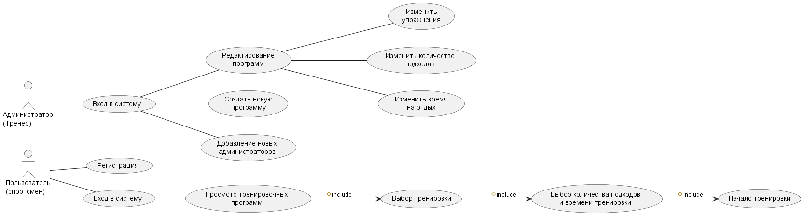

# Учёт тренировочных программ

## Описание
Система хранит тренировочные программы и упражнения.
Тренер создаёт программы, спортсмен их просматривает.

## Возможности
- создание тренировочной программы
- добавление упражнений
- просмотр списка программ

## Роли
| Роль | Что делает |
| --- | --- |
| Тренер | создаёт и изменяет программы |
| Спортсмен | просматривает и использует программы |

## Технологии
**Язык:** Python, **БД:** SQLite

## Диаграмма

Подробнее: [GitHub](https://github.com)